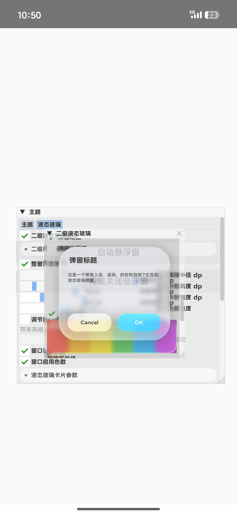
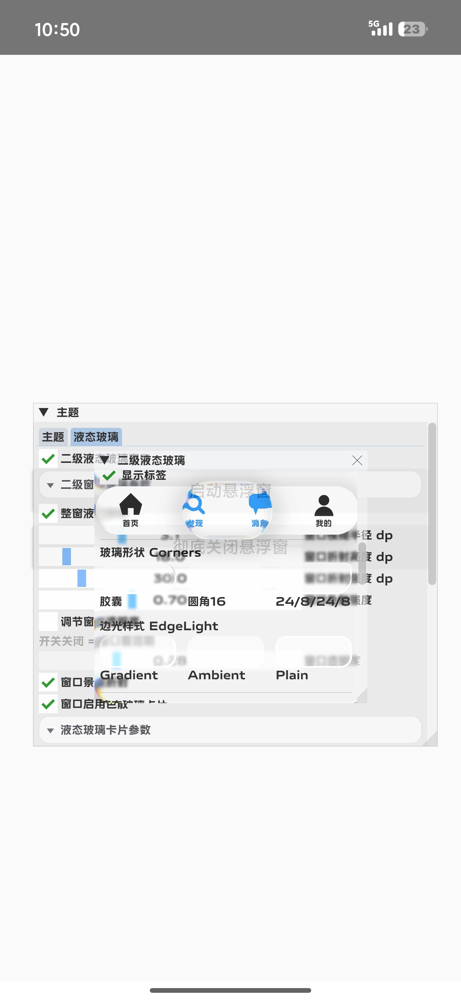
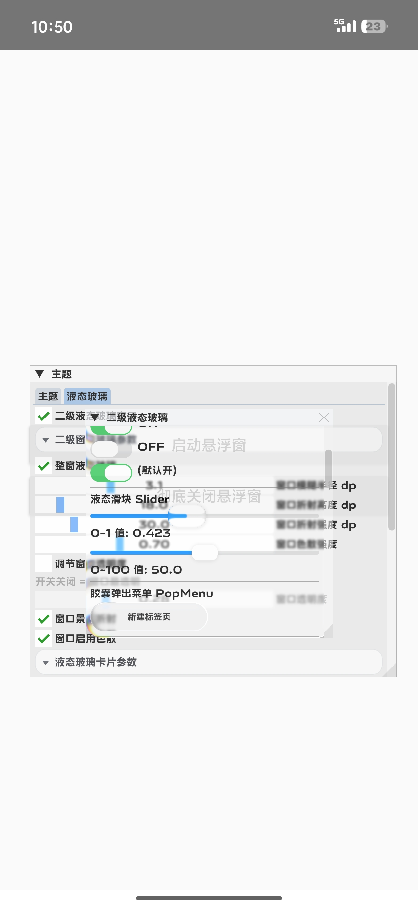
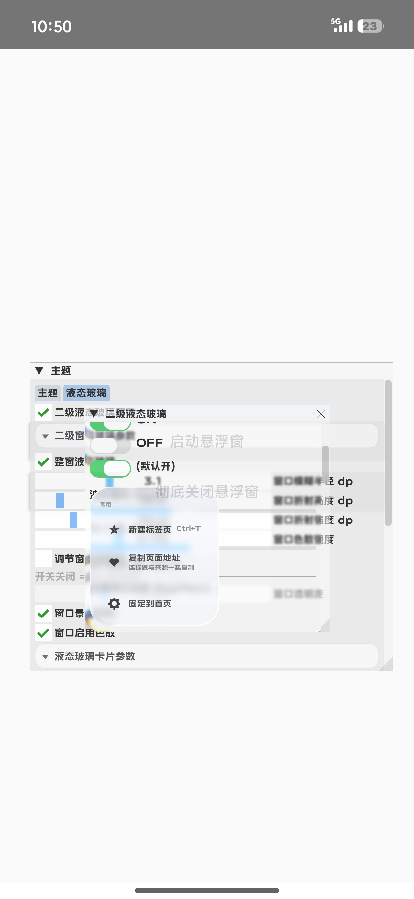
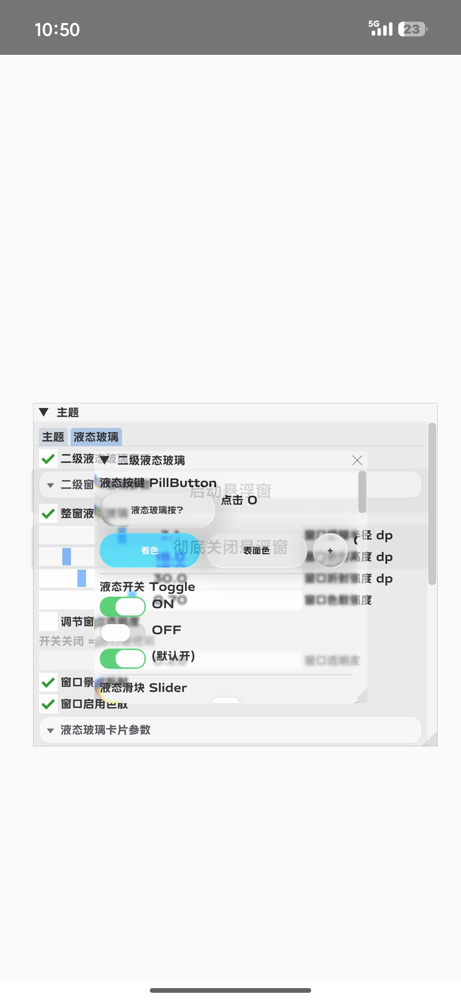
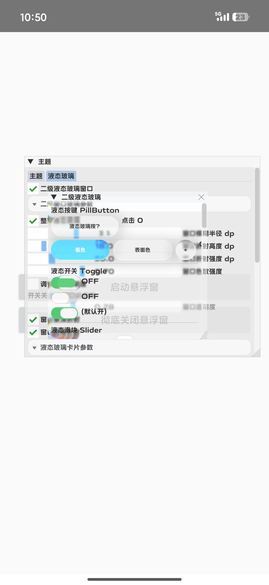

# LiquidGlass-Cpp

本项目（LiquidGlass-Cpp）是基于 Kyant 项目的 C++ 独立移植与二次开发。

## 声明
- 本文件由 SilentEaves (默檐) 于 2026 年独立完成 C++ 移植与二次修改。
- 具体修改包括：将原项目（Kotlin）逻辑重写为 C++。
- 本项目同样遵守并应用 Apache License, Version 2.0 协议。

## 第三方开源项目声明
本项目的核心代码逻辑移植自 AndroidLiquidGlass 项目，来源 Kyant 的液态玻璃项目。
- 原项目版权：Copyright 2025 Kyant
- 原项目地址：https://github.com/Kyant0/AndroidLiquidGlass
- 原项目许可证：Apache License, Version 2.0

## 免责声明
本项目（LiquidGlass-Cpp）是由 SilentEaves 独立开发的第三方非官方 C++ 移植版本，仅基于开源协议对原项目进行学习与移植。

本项目与原作者 Kyant 及其官方项目没有直接的隶属关系。原作者不对本项目的代码质量及维护负责。本项目仅供学习交流。

## 效果展示

